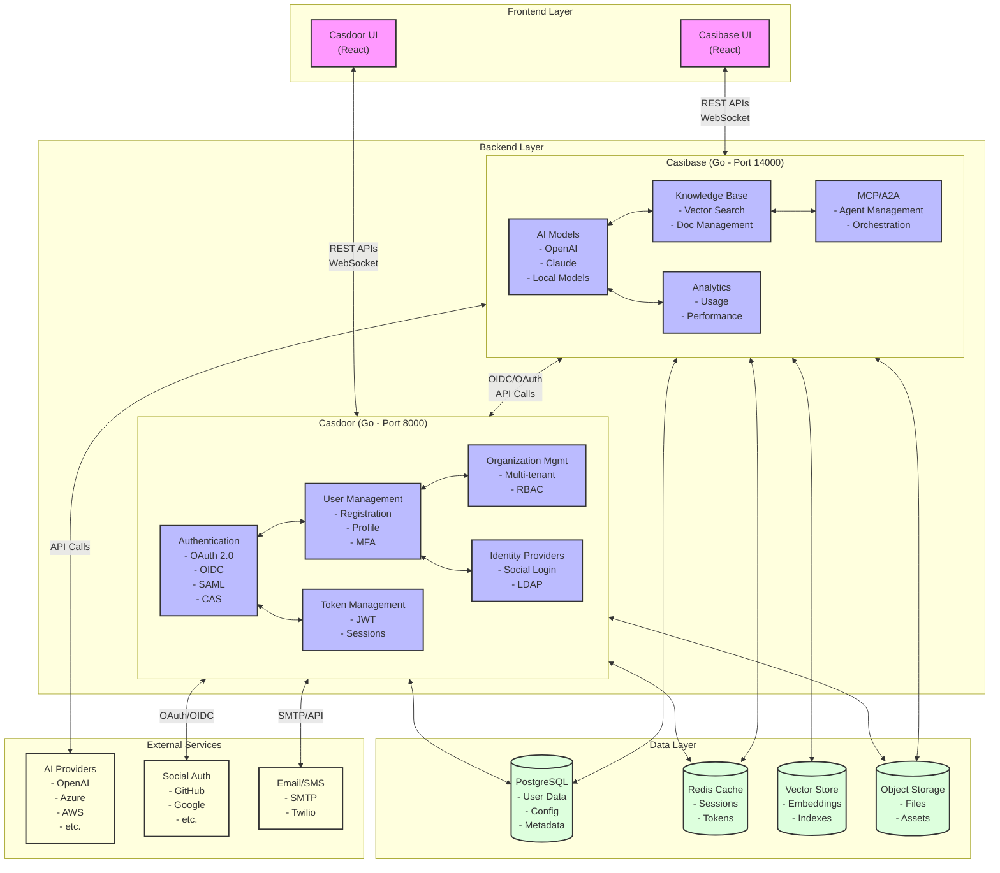

# Casdoor & Casibase

A comprehensive Identity and Access Management (IAM) and AI platform consisting of two main components.

Forked from: **[https://github.com/casdoor/casdoor]()**

## 🚪 Casdoor - Identity & Access Management

**Casdoor** is an open-source UI-first Identity and Access Management (IAM) / Single-Sign-On (SSO) platform with web UI supporting OAuth 2.0, OIDC, SAML, CAS, LDAP, SCIM, WebAuthn, TOTP, MFA and RADIUS.

### Key Features

- **Authentication**: OAuth 2.0, OIDC, SAML, CAS, LDAP, SCIM, WebAuthn, TOTP, MFA, RADIUS
- **User Management**: User registration, profile management, password policies
- **Organization Management**: Multi-tenant support with organization-based access control
- **Authorization**: Role-based access control (RBAC) with Casbin integration
- **Web UI**: Modern, responsive web interface for administration
- **REST API**: Comprehensive API for integration with external systems

### Documentation

- **Website**: https://casdoor.org
- **Installation Guide**: https://casdoor.org/docs/basic/server-installation
- **Docker Setup**: https://casdoor.org/docs/basic/try-with-docker
- **Kubernetes**: https://casdoor.org/docs/basic/try-with-helm

## 🤖 Casibase - AI Knowledge Base & Management Platform

**Casibase** is an AI Cloud OS: Open-source enterprise-level AI knowledge base and MCP (model-context-protocol)/A2A (agent-to-agent) management platform with admin UI, user management and Single-Sign-On, supports ChatGPT, Claude, Llama, Ollama, HuggingFace, etc.

### Key Features

- **AI Model Support**: Integration with 20+ AI models including OpenAI GPT, Claude, Local models, DeepSeek, Azure, AWS Bedrock, and more
- **Knowledge Base**: Vector search and document management with embedding support
- **MCP Integration**: Model Context Protocol support for AI agent communication
- **Admin UI**: Web-based administration interface
- **Multi-tenant**: Organization-based isolation and management
- **SSO Integration**: Seamless integration with Casdoor for authentication

### Supported AI Models

#### Language Models

- **OpenAI**: GPT-3.5, GPT-4, GPT-4o series
- **Anthropic Claude**: Claude 2.0, 3.x series
- **Local Models**: Custom model support
- **DeepSeek**: DeepSeek Chat, Reasoner
- **Azure OpenAI**: Full Azure OpenAI model support
- **AWS Bedrock**: Claude, Command, Jurassic, Llama models
- **Qwen**: Qwen-turbo, Qwen-plus, Qwen-max
- **Google Gemini**: Gemini Pro, Gemini Pro Vision
- **Hugging Face**: Llama-2, Falcon, BLOOM, and more
- **And many more**: Cohere, iFlytek, ChatGLM, MiniMax, Ernie, Moonshot, Baichuan, Doubao, StepFun, Hunyuan, Mistral

#### Embedding Models

- **OpenAI**: text-embedding-ada-002, text-embedding-3-small/large
- **Azure**: Azure OpenAI embedding models
- **Hugging Face**: sentence-transformers models
- **Qwen**: text-embedding series
- **And more**: Cohere, Ernie, MiniMax, Hunyuan, Jina embeddings

### Documentation

- **Website**: https://casibase.org
- **Installation Guide**: https://casibase.org/docs/basic/server-installation

## 🏗️ Architecture

This repository contains two primary applications with both backend and frontend parts. The high-level responsibilities and interactions are summarized below.

### Casdoor (Identity & Access)

- Backend (Go)
   - Responsibilities: authentication (OAuth2/OIDC/SAML/CAS), user and organization management, RBAC/authorization (Casbin), token/session management, and SSO provider endpoints.
   - Technology: Go, PostgreSQL, optional Redis for caching, Casbin for authorization.
   - Typical port: 8000 (configurable via `conf/app.conf`).
   - Exposes: REST APIs and OIDC/OAuth endpoints used by clients and other services (e.g., Casibase).

- Frontend (React)
   - Responsibilities: admin UI for user/org/app management, login/consent screens, developer settings and client registration.
   - Located in: `casdoor/web` — built assets served via static files or integrated into a web server.

### Casibase (AI Knowledge Base & Platform)

- Backend (Go)
   - Responsibilities: AI model integrations, embedding/vector search, knowledge management, MCP/A2A orchestration, admin APIs, and business logic.
   - Technology: Go, PostgreSQL (or other supported DB), a vector store (local or external), optional Redis, integrations to external AI providers.
   - Typical port: 14000 (configurable via `conf/app.conf`).
   - Integrates with Casdoor for authentication (OIDC/OAuth) and relies on Casdoor-issued client credentials for SSO flows.

- Frontend (React)
   - Responsibilities: admin dashboard, content/model management UIs, user-facing pages for chat/knowledge access.
   - Located in: `casibase/web` — built with Node/yarn and served as static assets or via a web server.

### Data stores & shared services

- Primary relational DB: PostgreSQL (separate databases recommended for Casdoor and Casibase, though single DB with schemas is possible).
- Vector store: embeddings and vector indexes (can be local, FAISS, Milvus, or hosted vector db).
- Redis: optional for caching, sessions, queues.
- Object storage: S3-compatible storage or local filesystem for uploaded files and static assets.

### Communication & SSO flow (high-level)

1. Casibase redirects users to Casdoor for authentication (OIDC/OAuth authorization code flow).
2. Casdoor authenticates the user, issues tokens (ID token / access token), and redirects back to Casibase with a code.
3. Casibase exchanges the code for tokens, validates the ID token, and establishes an authenticated session for the user.
4. Casibase uses Casdoor-provided user and organization data for authorization and multi-tenant scoping.

ASCII overview:

```
[Browser] <---> [Casibase Frontend (web)]
      |                     |
      |  (redirect to)      |  (calls APIs)
      v                     v
 [Casdoor] <--- OIDC/OAuth ---> [Casibase Backend]
    (Auth provider)             (Uses tokens, calls APIs)
         |                            |
         |                            +--> Vector store / AI providers
         +--> PostgreSQL, Redis, S3
```

### Deployment notes

- Run backends as services (containers or systemd) and serve built frontend assets from a CDN or a web server.
- Use environment-specific configs for ports, database connection strings and Casdoor client credentials (do not commit secrets).
- For production: enable TLS for all public endpoints, protect the Casdoor admin console, and consider using a reverse proxy / ingress controller.
- If you plan to store large model weights or binary artifacts in the repo, use Git LFS or an external artifact store.

This section is intentionally high-level. Below is a detailed architecture diagram showing the components and their interactions:

### Detailed Architecture Diagram



The diagram above illustrates:
- Frontend Layer: React-based UIs for both Casdoor and Casibase
- Backend Layer: Core services and their internal components
- Data Layer: Persistent storage and caching
- External Services: Third-party integrations and providers
- Key interactions and data flows between components

## 🚀 Quick Start

### Prerequisites

- Go 1.21+ for Casdoor, Go 1.23+ for Casibase
- Node.js and yarn for frontend builds
- PostgreSQL database
- Redis (optional, for caching)

### Installation & Setup

1. **Clone the repository**

   ```bash
   git clone https://github.com/casbin/casbin
   cd casbin
   ```
2. **Database Setup**

   ```bash
   # Create PostgreSQL database
   createdb casdoor
   createdb casibase
   ```
3. **Casdoor Setup**

   ```bash
   cd casdoor
   # Copy and modify configuration
   cp conf/app.conf conf/app.conf.local
   # Edit conf/app.conf.local with your database settings
   ```
4. **Casibase Setup**

   ```bash
   cd ../casibase
   # Configuration will be handled through Casdoor integration
   ```
5. **Build Frontend Assets**

   ```bash
   # Casdoor frontend
   cd ../casdoor/web
   yarn install
   yarn build

   # Casibase frontend
   cd ../../casibase/web
   yarn install
   yarn build
   ```
6. **Start Services**

   ```bash
   # Terminal 1: Start Casdoor backend
   cd ../casdoor && go run main.go

   # Terminal 2: Start Casibase backend
   cd ../casibase && go run main.go
   ```
7. **Access Applications**

   - Casdoor: http://localhost:8000
   - Casibase: http://localhost:14000

## 🔧 Configuration

### Casdoor Configuration (app.conf)

```ini
appname = casdoor
httpport = 8000
runmode = dev
driverName = postgres
dataSourceName = "user=postgres password=your_password host=localhost port=5432 sslmode=disable dbname=casdoor"
redisEndpoint = "localhost:6379"  # Optional
```

### Complete Casdoor Configuration Example

```ini
POSTGRES_PASSWORD=postgres
POSTGRES_USER=postgres
POSTGRES_DB=postgres

appname=casdoor
httpport=8000
runmode=dev
SessionOn=true
copyrequestbody=true
driverName=postgres
dataSourceName="user=postgres password=postgres host=localhost port=5432 sslmode=disable dbname=postgres"
dbName=postgres
tableNamePrefix=
showSql=false
redisEndpoint=
defaultStorageProvider=
isCloudIntranet=false
authState="casdoor"
socks5Proxy="127.0.0.1:10808"
verificationCodeTimeout=10
initScore=2000
logPostOnly=true
origin="https://auth.xxxxx.com"
staticBaseUrl="https://cdn.casbin.org"
enableGzip=true
```

### Casibase Configuration Integration

Casibase integrates with Casdoor for authentication. Configure the following in your Casibase setup:

```ini
casdoorEndpoint = http://localhost:8000
clientId = your_client_id
clientSecret = your_client_secret
casdoorOrganization = "your_organization"
casdoorApplication = "your_application"
```

### Complete Casibase Configuration Example

```ini
appname = casibase
httpport = 14000
runmode = dev
SessionOn = true
copyrequestbody = true
driverName = postgres
dataSourceName = user=postgres password=postgres host=localhost port=5432 sslmode=disable dbname=postgres
dbName = postgres
redisEndpoint =
guacamoleEndpoint = 127.0.0.1:4822
isDemoMode = false
disablePreviewMode = false
logPostOnly = true
landingFolder =
casdoorEndpoint = http://localhost:8000
clientId = 9d0193c1d5087fac2b67
clientSecret = 83e89863590adc6db6238a94888128abf026cb5d
casdoorOrganization = "casibase"
casdoorApplication = "app-casibase"
redirectPath = /callback
cacheDir = "./casibase_cache"
appDir = ""
isLocalIpDb = false
audioStorageProvider = ""
providerDbName = ""
socks5Proxy = "127.0.0.1:10808"
publicDomain = ""
adminDomain = ""
enableExtraPages = false
shortcutPageItems = []
usageEndpoints = []
iframeUrl = ""
forceLanguage = ""
defaultLanguage = "en"
staticBaseUrl = "https://cdn.casibase.org"
htmlTitle = "Casibase"
faviconUrl = "https://cdn.casibase.com/static/favicon.png"
logoUrl = "https://cdn.casibase.org/img/casibase-logo_1200x256.png"
navbarHtml = ""
footerHtml = "Powered by `<a target="_blank" href="https://github.com/casibase/casibase" rel="noreferrer">``</a>`"
appUrl = ""
frontendBaseDir = "../casibase"
showGithubCorner = false
defaultThemeType = "default"
defaultColorPrimary = "#5734d3"
defaultBorderRadius = 6
defaultIsCompact = false
avatarErrorUrl = "https://cdn.casibase.org/gravatar/error.png"
logConfig = {"adapter":"file", "filename": "logs/casibase.log", "maxdays":99999, "perm":"0770"}
```

### Casdoor-Casibase Integration Setup

#### 1. Create Organization in Casdoor

- **Organization Name**: casibase
- **Display Name**: casibase

#### 2. Create Application in Casdoor

- **Application Name**: app-casibase
- **Display Name**: casibase
- **Organization**: casibase
- **Client ID**: 9d0193c1d5087fac2b67
- **Client Secret**: 83e89863590adc6db6238a94888128abf026cb5d

#### 3. Add Certificate

- **Certificate Name**: cert_casbin

#### 4. Bind Certificate to Application

- **Certificate**: cert_casbin

#### 5. Add Users to Casibase Organization

- **Signup Application**: app-casibase

## 🛠️ Development

### Project Structure

```
├── casdoor/          # IAM/SSO Platform
│   ├── conf/         # Configuration files
│   ├── controllers/  # HTTP handlers
│   ├── object/       # Data models
│   ├── web/          # Frontend React app
│   └── main.go       # Application entry point
└── casibase/         # AI Platform
    ├── model/        # AI model integrations
    ├── object/       # Data structures
    ├── web/          # Frontend React app
    └── main.go       # Application entry point
```

### Building for Production

Add to both `package.json` files under "scripts":

```json
"build": "NODE_OPTIONS=\"--max-old-space-size=8192\" craco build"
```
